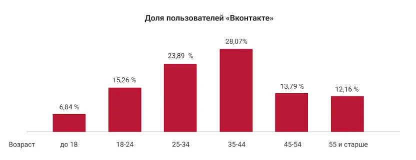
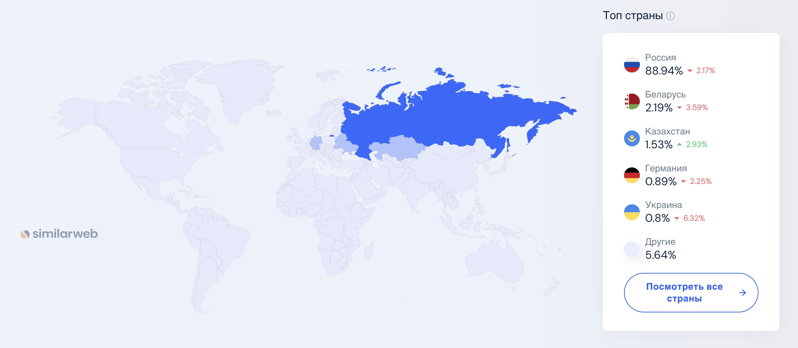

# highload-vk-messenger

## Содержание
  ### [1. Тема и целевая аудитория](#topic)
  ### [2. Расчет нагрузки](#load)
  ### [3. Глобальная балансировка](#global_balancing)
  ### [4. Локальная балансировка](#local_balancing)
  ### [Список источников](#sources)

## 1. Тема и целевая аудитория
### Тема
**VK мессенджер** — отдельное приложение для переписки ВКонтакте. Это удобное средство общения для тех, кто не готов отвлекаться на новости, но хочет всегда оставаться на связи.

### Целевая аудитория
#### Возраст и пол
По данным Brand Analytics [^2], это люди в возрасте 25–44 лет, 62% - женщины, 38% - мужчины.

MAU VK мессенджера в России равен 72.9 млн [^1], доля пользователь России - 88.94% [^11], т.е. глобальный MAU VK мессенджера равен 72.9 млн / 0.8894 = 81.96 млн.

#### География
В основном трафик из СНГ, наибольше всего из России - 88.94%.
При MAU равном 81.96 млн [^1]:
- Россия - 72.9 млн
- Беларусь - 1.8 млн
- Казахстан - 1.25 млн
- Германия - 0.73 млн
- Украина - 0.65 млн
- Другие - 4.62 млн
  

### MVP 
1. Регистрация по номеру телефона
2. Отправка сообщений
3. Чтение чата
4. Список чатов
5. Вложения (фото/видео/голос/файлы)
6. Список контактов

### Ключевые продуктовые решения
1. Интеграция с экосистемой VK
2. Общие пользователи с VK
3. Мультиплатформенность

## 2. Расчет нагрузки
### Продуктовые метрики

Метрики соцсети VK: DAU - 77 млн, MAU - 87,9 млн [^1], т.е. 87.6% ежемесячных пользователей заходят каждый день. 
Пользователи VK мессенджер являются частью пользователей соцсети VK, следовательно их поведение не должно сильно отличатся от пользователей соцсети VK, тогда DAU VK мессенджера равна 81.96 млн * 87.6% = 71.8 млн

Таблица 1 - Количество активных пользователей

| Период         | Количество пользователей |
|----------------|--------------------------|
| MAU            | 81.96 млн     |
| DAU            | 71.8 млн      |

VK не публиковало информацию о чатах и среднем размере хранилища пользователей, поэтому было принято решение провести опрос.  Было опрошено 10 пользователей VK мессенджера: в среднем у пользователя 58 чатов: 42 личных чата, 16 групповых чатов; среднее количествоучастников в групповых чатах - 14; Средний размер хранилища - 8.27 ГБ.

Таблица 2 - Средний размер хранилища пользователя

<table>
    <tr>
        <th>Тип</th>
        <th>Размер</th>
    </tr>
    <tr>
        <td>Аватарка</td>
        <td>Максимальный размер аватарки 5 МБ; я взял 10 случайных пользователей, в среднем у каждого по 10 аватарок, т.е. общий объем 5 * 10 = 50 МБ</td>
    </tr>
    <tr>
        <td>Информация о профиле</td>
        <td>2 КБ</td>
    </tr>
    <tr>
        <td>Личное хранилище</td>
        <td> 8.27 ГБ </td>
    </tr>
    <tr>
        <td>Итог</td>
        <td>8.28 ГБ</td>
    </tr>
</table>

Пользователи отправляют 15 млрд сообщений в сутки [^3], но это статистика по соцсети VK, могла быть включена отправка комментариев, поэтому было принято решение расчитать данную метрику в Whatsapp.

В Whatsapp 2.64 млрд DAU и 100 млрд сообщений в день [^13], т.е в среднем 100 млрд / 2.64 млрд = 37.88 сообщений в день от одного пользователя.

Таблица 3 - Действия пользователей по типам

| Тип действия         |Среднеее количество в день |
|----------------|--------------------------|
| Отправка сообщений            | 37.88 |
| Чтение сообщений | Если в среднем у пользователя 58 чатов, из которых 16 - групповые, а в групповых в среднем по 14 учатников, отправивший сообщение в групповом чате очень редко будет его скачивать с сервера, поэтому поэтому получать, в среднем, будут  (42 * 1 + 16 * (14-1))/58 = 4.31 пользователей, т.е. если в среднем отправляют 37.88 сообщений в день: 37.88 * 4.31 = 163 сообщений в день |
| Авторизация/регистрация           | Данная метрика не в VK мессенджере не публиковалась, в Whatsapp заходят 14.4 раз в день[^12]   |
| Добавление пользователей в контакты | Каждый день 5.5 млн пользователей добавляют пользователей в контакты [^4], т.е. в среднем 5.5 млн / 76 млн = 0.07 добавлений в контакты в день от одного пользователя |

### Технические метрики

Для оценки соотношения типов отправленных сообщений воспользуемся данными с сайта [^7], там сказано, что из всех сообщений: с фото - 20%, с видео - 10%,с остальными типами файлов - 5%.

VK не публиковало информацию о количестве отправляемых пользователями голосовых сообщений, поэтому было принято решение взять статистику мессенджера Whatsapp [^8]: 7 млрд голосовых в день при 100 млрд текстовых сообщений в день, т.е. 7% от общего числа сообщений. Тогда пользователь VK мессенджера в среднем отправляет 37.88 * 0.07 =  2.65 голосовых сообщений в день.

Таблица 4 - RPS

| Тип действия | RPS | пиковый RPS (двойная нагрузка) |
|--------------|-----|------------|
| отправка сообщений| 71.8 млн * 37.88  / (24 * 60 * 60) = 31,478 | 62,957 |
| отправка сообщений с фото | 71.8 млн * 37.88* 0.2 / (24 * 60 * 60) = 6,295 | 12,591 |
| отправка сообщений с видео | 71.8 млн * 37.88 * 0.1 / (24 * 60 * 60) =  3,147 | 6,295 |
| отправка голосовых сообщений | 71.8 млн * 9.52 / (24 * 60 * 60) = 7,911 | 15,822 |
| отправка сообщений с файлами | 71.8 млн * 37.88 * 0.05 / (24 * 60 * 60) = 1,573 | 3,147 |
| чтение сообщений | 71.8 млн * 163 / (24 * 60 * 60) = 135,454  | 270,912 |
| чтение сообщений с фото | 71.8 млн * 163 * 0.2 / (24 * 60 * 60) = 27,091 | 54,182 |
| чтение сообщений с видео | 71.8 млн * 163 * 0.1 / (24 * 60 * 60) = 13,546  | 27,091 |
| чтение голосовых сообщений | 71.8 млн * 2.65 * 4.31 / (24 * 60 * 60) = 9,497  | 18,994 |
| чтение сообщений с файлами | 71.8 млн * 163 * 0.05 / (24 * 60 * 60) = 6,773 | 13,546 |
|  Авторизация  | 71.8 млн * 14.4 / (24 * 60 * 60) = 11,966 | 23,933 |
|  Добавление пользователей в контакты  | 71.8 млн * 0.07 / (24 * 60 * 60) = 58 | 116 |

Средння длина сообщения 10 слов [^6], cредняя длина слова 5.28 символов [^7]. В основном в VK мессенджере отправляют сообщения на русском языке, 1 символ кириллицы весит 2 байта, таким образом размер текстового сообщения:
10 слов * 5.28 букв * 2 байта = 840 б, если учесть метаданные, то размер сообщения может увеличитя до 512 Б.

Пусть средний размер отправляемой фотографии будет 5 МБ, средний размер видео 60 МБ, а остальные файлы - 10 МБ.

Битрейт голосового сообщения в VK мессенджер равен 64 Кб/с. Пусть средняя продолжительность будет 20 секунд, тогда трафик будет равен 7,911 * 64 Кб * 20 = 9.657 Гб/c.

 Авторизация в мессенджерах обычно требует минимального объема трафика. Расчет производился на основе реального запроса: URL - 82 Б, заголовки - 400 Б, тело - 330 Б, ответ - 900 Б. Итого около 2 КБ, с учетом переменной длины определенных тегов, на авторизацию уйдет 3 КБ.

Таблица 5 - Сетевой трафик

| Тип действия | Трафик, Гб/c | Пиковый трафик (двойная нагрузка), Гб/c |
|--------------|-----|------------|
| отправка сообщений | 31,478 * 512 Б = 0.015 | 0.03 |
|  отправка сообщений с фото |  6,295 * (512 Б + 5 МБ) = 245.901  | 491.803 |
  |отправка сообщений с видео  | 3,147 * (512 Б + 60 МБ) = 1,475.158  | 2,950.316 |
|отправка голосовых сообщений  | 7,911 * 64 Кб * 20 = 9.657 | 19.314 |
| отправка сообщений с файлами | 1,573 * (512 Б + 5 МБ) = 61.446 | 122.892 |
| чтение сообщений |  134,456 * 512 Б = 0.065 | 0.129 |
| чтение сообщений с фото | 27,091 * (512 Б + 5 МБ) = 1058.263 | 2116.526 |
|чтение сообщений с видео  | 13,546 * (512 Б + 60 МБ) = 6,349.507  | 12,699.015 |
| чтение голосовых сообщений | 9,497 * 64 Кб * 20 = 11,593  | 23.187 |
| чтение сообщений с файлами | 6,773 * (512 Б + 5 МБ) = 261.98 | 523.964 |
|  Авторизация | 11,966 * 3 КБ = 0.274 | 0.548 |

Для подсчета сжатия фото я загрузил 10 фото размером 5 МБ в VK мессенджер, средний процент сжатия составил 87%, т.е. объем сжатого фото составляет 13% от исходного.

VK использует видеокодек AV1 [^9], он сжимает в среднем на 50% от изначального объема видео [^10]. 

Таблица 6 - Основное хранилище

| Тип данных | Объем, ПБ |
|------------|-----------|
| Данные пользователей | 8.28 ГБ * 81.96 млн = 647.19 |

Таблица 7 - Рост хранилища

| Тип данных | Объем в день, ПБ | Объем в месяц, ПБ |
|------------|--------------|---------------|
| Текст | 0.015 Гб/c * 24ч * 60м * 60с = 0.00015 | 0.00464 |
| Фото | 245.901 Гб/c * 24ч * 60м * 60с * 0.13 = 0.33 | 9.88 |
| Видео | 1475.158 Гб/c * 24ч * 60м * 60с * 0.5 = 7.6 | 227.9 |
| Голосовые | 9.657 Гб/c * 24ч * 60м * 60с = 0.1 | 2.98 |
| Прочие файлы | 61.45 Гб/c * 24ч * 60м * 60с = 0.63 | 18.99 |
| Итог | 8.66 | 259.76 |

### Глобальная балансировка нагрузки

#### Функциональное разбиение по доменам

- Основной домен (используется и как мобильная версия): `web.vk.me`
- API: `api.vk.me`
- Мобильная версия: `m.vk.com`
- Статический контент: `st1-XX.vk.com` и `static.vk.com`
- Медиаконтент: `sun1-XX.userapi.com`

#### Обоснования расположения ДЦ

Основной трафик из России - 88.94%, поэтому дата-центры будут расположены в РФ. Наибольшая плотность населения в европейской части, следовательно, дата-центры следует расположить именно там. Находиться они будут в крупных городах, так как у них должна быть хорошо развита инфраструктура, что уменьшит расходы на размещение серверов.

Таблица 8 - Населения РФ по округам с распределением по дата-центрам

| Округ | Население, млн | Население, % | Основной дата-центр |
|-|-|-|-|
| ЦФО | 40 | 27.5 | Москва |
| ПФО | 29 | 19,5 | Екатеринбург |
| ЮФО | 16 | 11.4 | Ростов-на-Дону |
| СФО | 16 | 11.3 | Новосибирск |
| СЗФО | 14 | 9.5 | Санкт-Петербург |
| УрФО | 12 | 8.4 | Екатеринбург |
| СКФО | 10 | 7 | Ростов-на-Дону | 
| ДВФО | 8 | 5.4 | Новосибирск |	

Также есть трафик из других стран (Беларусь - 2.19%, Казахстан - 1.53%, Германия - 0.89%, Украина - 0.8%, Другие - 5.64%). Трафик с Беларуси и Германии будет направлен в Москву, с Казахстана в Екатеринбург и Новосибирск, с Украины в Ростов-на-Дону, а с других мест будет распределен по всем дата-центрам поровну.

Таблица 9 - Нагрузка на дата-центры

| Город | Относительная нагрузка, % |
|-|-|
| Москва | 27.5 * 88.94% + 2.19% + 0.89% + (5.64% / 5) = 28.67% |
| Екатеринбург | 27.9% * 88.94% + 1.53% / 2 + (5.64% / 5) = 26.71% |
| Ростов-на-Дону | 18.4 * 88.94% + 0.8% + (5.64% / 5) = 18.29% |
| Новосибирск | 16.7 * 88.94% + 1.53% / 2 + (5.64% / 5) = 16.75% |
| Санкт-Петербург | 9.5% + (5.64% / 5) = 9.58% |

Основной сервер будет распологаться в Москве, так как он имеет наибольшее население и расположен по центру от наибольшее населенных округов (ЦФО, ПФО, ЮФО, СЗФО).

#### Расчет распределение запросов из секции "Расчет нагрузки" по типам запросов по дата-центрам

Таблица 10 - Запросы по типам по дата-центрам

| Тип запроса | Москва, RPS | Екатеринбург, RPS | Ростов-на-Дону, RPS |  Новосибирск, RPS | Санкт-Петербург, RPS |
|-|-|-|-|-|-|
| отправка сообщений           | 31,478 | - | - | - | - |
| отправка сообщений с фото    | 6,295 | - | - | - | - |
| отправка сообщений с видео   | 3,147 | - | - | - | - |
| отправка голосовых сообщений | 7,911 | - | - | - | - |
| отправка сообщений с файлами | 1,573 | - | - | - | - |
| чтение сообщений             | 38,830 | 36,176 | 24,778 | 22,683 | 12,973 |
| чтение сообщений с фото      | 7,766 | 7,235 | 4,955 | 4,536 | 2,594 |
| чтение сообщений с видео     | 3,883 | 3,617 | 2,477 | 2,268 | 1,297 |
| чтение голосовых сообщений   | 2,722 | 2,536 | 1,737 | 1,590 | 909 |
| чтение сообщений с файлами   | 1,941 |1,808|	1,238	|1,134	|648|
|  Авторизация                 | 11,966 | - | - | - | - |
|  Добавление пользователей в контакты | 58 | - | - | - | - |

#### Схема баланировки

Балансировка трафика будет происходить с помощью BGP Anycast, т.к. дата-центры расположены относительно на небольшой расстоянии, к тому же BGP Anycast автоматически перенаправит трафик, если один из дата-центров будет недоступен.

| Местоположение пользователя    | Ожидаемый дата-центр |
|------------------------|---------------------|
| ЦФО | Москва |
| ПФО | Екатеринбург |
| ЮФО | Ростов-на-Дону |
| СФО | Новосибирск |
| СЗФО | Санкт-Петербург |
| УрФО | Екатеринбург |
| СКФО | Ростов-на-Дону | 
| ДВФО | Новосибирск |
| Казахстан	 | Екатеринбург |     
| Беларусь   | Москва |
| Германия   | Москва |
| Украина   | Ростов-на-Дону |

### Локальная балансировка нагрузки

1. L7-балансировка между сервисами внутри дата-центра
    - SSL-терминация 
    - Nginx распределяет трафик между сервисами в зависимости от URL запроса, заголовков и нагрузки на сервера

2. Маршрутизация в Kubernetes между подами
    - Kubernetes получает запрос и перенаправляет его на нужный сервис через ingress-nginx.
    - K8s Service определяет, какой конкретный под обработает запрос.
    - Если под недоступен, запрос перенаправляется на следующий.

3. Обработка на бекенде
    - Приложение обрабатывает запрос и взаимодействует с базой данных, кэшем, API других сервисов.

#### Схема отказоустойчивости

1. Kubernetes
   - readiness-пробы для мониторинга состояния готовности подов.
   - liveness-пробы для мониторинга состояния роботоспособности подов.

2. NGINX
   - Перезапускает серверы без downtime.
   - Реализует retry запросов на другой сервер, если один из серверов не отвечает.
   - Обновляет конфигурации без прерывания работы.

## Источники
[^1]: [Пресс-релиз по результатам за 2 кв. и 1 пол. 2024](https://vk.company/ru/press/releases/11805/)

[^2]: [Анализ целевой аудитории VK от Demis Group](https://www.demis.ru/articles/celevaya-auditoria-vkontakte/)

[^3]: [Данные с официального сайта VK](https://vk.com/about)

[^4]: [Исследование дружбы в VK от Вконтакте 2023 года](https://vk.com/press/friends-research)

[^5]: [Анализ длины сообщений](https://www.researchgate.net/publication/299487660_WhatsApp_Usage_Patterns_and_Prediction_Models)

[^6]: [Анализ длины слов]([https://norvig.com/mayzner.html](http://lingvisto.org/artikoloj/ru_stat.html))

[^7]: [Ежегодный отчет Cisco по Интернету (2018–2023 гг.)](https://www.cisco.com/c/en/us/solutions/collateral/executive-perspectives/annual-internet-report/white-paper-c11-741490.html)

[^8]: [Статистика Whatsapp](https://www.coolest-gadgets.com/whatsapp-statistics/)

[^9]: [Видеокодек VK](https://www.forbes.ru/tekhnologii/520576-zakodirovat-ot-lisnego-vesa-vk-vlozila-100-mln-rublej-v-tehnologiu-szatia-video)

[^10]: [Официальный сайт aomedia](https://aomedia.org/)

[^11]: [Анализ vk.com от similarweb](https://www.similarweb.com/ru/website/vk.com/#overview)

[^12]: [Анализ мессенджеров от tadviser](https://www.tadviser.ru/index.php/%D0%A1%D1%82%D0%B0%D1%82%D1%8C%D1%8F:%D0%9C%D0%B5%D1%81%D1%81%D0%B5%D0%BD%D0%B4%D0%B6%D0%B5%D1%80%D1%8B_(Instant_Messenger,_IM))

[^13]: [Метрики Whatsapp](https://learn.rasayel.io/en/blog/whatsapp-user-statistics/)
