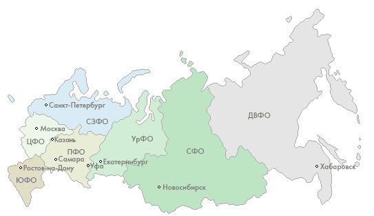
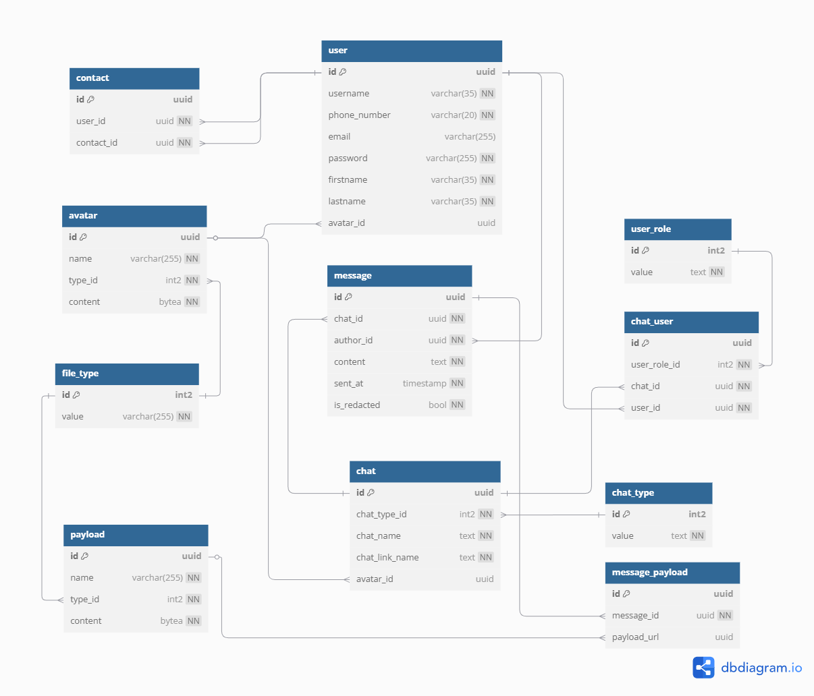

# highload-vk-messenger

## Содержание
  ### [1. Тема и целевая аудитория](#topic)
  ### [2. Расчет нагрузки](#load)
  ### [3. Глобальная балансировка](#global_balancing)
  ### [4. Локальная балансировка](#local_balancing)
  ### [5. Логическая схема БД](#logic_schema)
  ### [Список источников](#sources)

## 1. Тема и целевая аудитория
### Тема
**VK мессенджер** — отдельное приложение для переписки ВКонтакте. Это удобное средство общения для тех, кто не готов отвлекаться на новости, но хочет всегда оставаться на связи.

### Целевая аудитория
#### Возраст и пол
По данным Brand Analytics [^2], это люди в возрасте 25–44 лет, 62% - женщины, 38% - мужчины.

MAU VK мессенджера в России равен 72.9 млн [^1], доля пользователь России - 88.94% [^11], т.е. глобальный MAU VK мессенджера равен 72.9 млн / 0.8894 = 81.96 млн.

#### География
В основном трафик из СНГ, наибольше всего из России - 88.94%.
При MAU равном 81.96 млн [^1]:
- Россия - 72.9 млн
- Беларусь - 1.8 млн
- Казахстан - 1.25 млн
- Германия - 0.73 млн
- Украина - 0.65 млн
- Другие - 4.62 млн
  

### MVP 
1. Регистрация по номеру телефона
2. Отправка сообщений
3. Чтение чата
4. Список чатов
5. Вложения (фото/видео/голос/файлы)
6. Список контактов

### Ключевые продуктовые решения
1. Интеграция с экосистемой VK
2. Общие пользователи с VK
3. Мультиплатформенность

## 2. Расчет нагрузки
### Продуктовые метрики

Метрики соцсети VK: DAU - 77 млн, MAU - 87,9 млн [^1], т.е. 87.6% ежемесячных пользователей заходят каждый день. 
Пользователи VK мессенджер являются частью пользователей соцсети VK, следовательно их поведение не должно сильно отличатся от пользователей соцсети VK, тогда DAU VK мессенджера равна 81.96 млн * 87.6% = 71.8 млн

Таблица 1 - Количество активных пользователей

| Период         | Количество пользователей |
|----------------|--------------------------|
| MAU            | 81.96 млн     |
| DAU            | 71.8 млн      |

VK не публиковало информацию о чатах и среднем размере хранилища пользователей, поэтому было принято решение провести опрос.  Было опрошено 10 пользователей VK мессенджера: в среднем у пользователя 58 чатов: 42 личных чата, 16 групповых чатов; среднее количествоучастников в групповых чатах - 14; Средний размер хранилища - 8.27 ГБ.

Таблица 2 - Средний размер хранилища пользователя

<table>
    <tr>
        <th>Тип</th>
        <th>Размер</th>
    </tr>
    <tr>
        <td>Аватарка</td>
        <td>Максимальный размер аватарки 5 МБ; я взял 10 случайных пользователей, в среднем у каждого по 10 аватарок, т.е. общий объем 5 * 10 = 50 МБ</td>
    </tr>
    <tr>
        <td>Информация о профиле</td>
        <td>2 КБ</td>
    </tr>
    <tr>
        <td>Личное хранилище</td>
        <td> 8.27 ГБ </td>
    </tr>
    <tr>
        <td>Итог</td>
        <td>8.28 ГБ</td>
    </tr>
</table>

Пользователи отправляют 15 млрд сообщений в сутки [^3], но это статистика по соцсети VK, могла быть включена отправка комментариев, поэтому было принято решение расчитать данную метрику в Whatsapp.

В Whatsapp 2.64 млрд DAU и 100 млрд сообщений в день [^13], т.е в среднем 100 млрд / 2.64 млрд = 37.88 сообщений в день от одного пользователя.

Таблица 3 - Действия пользователей по типам

| Тип действия         |Среднеее количество в день |
|----------------|--------------------------|
| Отправка сообщений            | 37.88 |
| Чтение сообщений | Если в среднем у пользователя 58 чатов, из которых 16 - групповые, а в групповых в среднем по 14 учатников, отправивший сообщение в групповом чате очень редко будет его скачивать с сервера, поэтому поэтому получать, в среднем, будут  (42 * 1 + 16 * (14-1))/58 = 4.31 пользователей, т.е. если в среднем отправляют 37.88 сообщений в день: 37.88 * 4.31 = 163 сообщений в день |
| Авторизация/регистрация           | Данная метрика не в VK мессенджере не публиковалась, в Whatsapp заходят 14.4 раз в день[^12]   |
| Добавление пользователей в контакты | Каждый день 5.5 млн пользователей добавляют пользователей в контакты [^4], т.е. в среднем 5.5 млн / 76 млн = 0.07 добавлений в контакты в день от одного пользователя |

### Технические метрики

Для оценки соотношения типов отправленных сообщений воспользуемся данными с сайта [^7], там сказано, что из всех сообщений: с фото - 20%, с видео - 10%,с остальными типами файлов - 5%.

VK не публиковало информацию о количестве отправляемых пользователями голосовых сообщений, поэтому было принято решение взять статистику мессенджера Whatsapp [^8]: 7 млрд голосовых в день при 100 млрд текстовых сообщений в день, т.е. 7% от общего числа сообщений. Тогда пользователь VK мессенджера в среднем отправляет 37.88 * 0.07 =  2.65 голосовых сообщений в день.

Таблица 4 - RPS

| Тип действия | RPS | пиковый RPS (двойная нагрузка) |
|--------------|-----|------------|
| отправка сообщений| 71.8 млн * 37.88  / (24 * 60 * 60) = 31,478 | 62,957 |
| отправка сообщений с фото | 71.8 млн * 37.88* 0.2 / (24 * 60 * 60) = 6,295 | 12,591 |
| отправка сообщений с видео | 71.8 млн * 37.88 * 0.1 / (24 * 60 * 60) =  3,147 | 6,295 |
| отправка голосовых сообщений | 71.8 млн * 9.52 / (24 * 60 * 60) = 7,911 | 15,822 |
| отправка сообщений с файлами | 71.8 млн * 37.88 * 0.05 / (24 * 60 * 60) = 1,573 | 3,147 |
| чтение сообщений | 71.8 млн * 163 / (24 * 60 * 60) = 135,454  | 270,912 |
| чтение сообщений с фото | 71.8 млн * 163 * 0.2 / (24 * 60 * 60) = 27,091 | 54,182 |
| чтение сообщений с видео | 71.8 млн * 163 * 0.1 / (24 * 60 * 60) = 13,546  | 27,091 |
| чтение голосовых сообщений | 71.8 млн * 2.65 * 4.31 / (24 * 60 * 60) = 9,497  | 18,994 |
| чтение сообщений с файлами | 71.8 млн * 163 * 0.05 / (24 * 60 * 60) = 6,773 | 13,546 |
|  Авторизация  | 71.8 млн * 14.4 / (24 * 60 * 60) = 11,966 | 23,933 |
|  Добавление пользователей в контакты  | 71.8 млн * 0.07 / (24 * 60 * 60) = 58 | 116 |

Средння длина сообщения 10 слов [^6], cредняя длина слова 5.28 символов [^7]. В основном в VK мессенджере отправляют сообщения на русском языке, 1 символ кириллицы весит 2 байта, таким образом размер текстового сообщения:
10 слов * 5.28 букв * 2 байта = 840 б, если учесть метаданные, то размер сообщения может увеличитя до 512 Б.

Пусть средний размер отправляемой фотографии будет 5 МБ, средний размер видео 60 МБ, а остальные файлы - 10 МБ.

Битрейт голосового сообщения в VK мессенджер равен 64 Кб/с. Пусть средняя продолжительность будет 20 секунд, тогда трафик будет равен 7,911 * 64 Кб * 20 = 9.657 Гб/c.

 Авторизация в мессенджерах обычно требует минимального объема трафика. Расчет производился на основе реального запроса: URL - 82 Б, заголовки - 400 Б, тело - 330 Б, ответ - 900 Б. Итого около 2 КБ, с учетом переменной длины определенных тегов, на авторизацию уйдет 3 КБ.

Таблица 5 - Сетевой трафик

| Тип действия | Трафик, Гб/c | Пиковый трафик (двойная нагрузка), Гб/c |
|--------------|-----|------------|
| отправка сообщений | 31,478 * 512 Б = 0.015 | 0.03 |
|  отправка сообщений с фото |  6,295 * (512 Б + 5 МБ) = 245.901  | 491.803 |
  |отправка сообщений с видео  | 3,147 * (512 Б + 60 МБ) = 1,475.158  | 2,950.316 |
|отправка голосовых сообщений  | 7,911 * 64 Кб * 20 = 9.657 | 19.314 |
| отправка сообщений с файлами | 1,573 * (512 Б + 5 МБ) = 61.446 | 122.892 |
| чтение сообщений |  134,456 * 512 Б = 0.065 | 0.129 |
| чтение сообщений с фото | 27,091 * (512 Б + 5 МБ) = 1058.263 | 2116.526 |
|чтение сообщений с видео  | 13,546 * (512 Б + 60 МБ) = 6,349.507  | 12,699.015 |
| чтение голосовых сообщений | 9,497 * 64 Кб * 20 = 11,593  | 23.187 |
| чтение сообщений с файлами | 6,773 * (512 Б + 5 МБ) = 261.98 | 523.964 |
|  Авторизация | 11,966 * 3 КБ = 0.274 | 0.548 |

Для подсчета сжатия фото я загрузил 10 фото размером 5 МБ в VK мессенджер, средний процент сжатия составил 87%, т.е. объем сжатого фото составляет 13% от исходного.

VK использует видеокодек AV1 [^9], он сжимает в среднем на 50% от изначального объема видео [^10]. 

Таблица 6 - Основное хранилище

| Тип данных | Объем, ПБ |
|------------|-----------|
| Данные пользователей | 8.28 ГБ * 81.96 млн = 647.19 |

Таблица 7 - Рост хранилища

| Тип данных | Объем в день, ПБ | Объем в месяц, ПБ |
|------------|--------------|---------------|
| Текст | 0.015 Гб/c * 24ч * 60м * 60с = 0.00015 | 0.00464 |
| Фото | 245.901 Гб/c * 24ч * 60м * 60с * 0.13 = 0.33 | 9.88 |
| Видео | 1475.158 Гб/c * 24ч * 60м * 60с * 0.5 = 7.6 | 227.9 |
| Голосовые | 9.657 Гб/c * 24ч * 60м * 60с = 0.1 | 2.98 |
| Прочие файлы | 61.45 Гб/c * 24ч * 60м * 60с = 0.63 | 18.99 |
| Итог | 8.66 | 259.76 |

### Глобальная балансировка нагрузки

#### Функциональное разбиение по доменам

- Основной домен (используется и как мобильная версия): `web.vk.me`
- API: `api.vk.me`
- Статический контент: `st1-XX.vk.com` и `static.vk.com`
- Медиаконтент: `sun1-XX.userapi.com`

#### Обоснования расположения ДЦ

Основной трафик из России - 88.94%, поэтому дата-центры будут расположены в РФ. Наибольшая плотность населения в европейской части, следовательно, дата-центры следует расположить именно там. Находиться они будут в крупных городах, так как у них должна быть хорошо развита инфраструктура, что уменьшит расходы на размещение серверов.

Таблица 8 - Населения РФ по округам с распределением по дата-центрам

| Округ | Население, млн | Население, % | Основной дата-центр | Резервный дата-центр | 
|-|-|-|-|-|
| ЦФО | 40 | 27.5 | Москва | Санкт-Петербург |
| ПФО | 29 | 19,5 | Екатеринбург | Ростов-на-Дону |
| ЮФО | 16 | 11.4 | Ростов-на-Дону | Москва |
| СФО | 16 | 11.3 | Новосибирск | Екатеринбург |
| СЗФО | 14 | 9.5 | Санкт-Петербург | Москва |
| УрФО | 12 | 8.4 | Екатеринбург | Новосибирск |
| СКФО | 10 | 7 | Ростов-на-Дону | Москва |
| ДВФО | 8 | 5.4 | Новосибирск | Екатеринбург |

Также есть трафик из других стран (Беларусь - 2.19%, Казахстан - 1.53%, Германия - 0.89%, Украина - 0.8%, Другие - 5.64%). Трафик с Беларуси и Германии будет направлен в Москву, с Казахстана в Екатеринбург и Новосибирск, с Украины в Ростов-на-Дону, а с других мест будет распределен по всем дата-центрам поровну.

Таблица 9 - Нагрузка на дата-центры от запросов на получение данных

| Город | Относительная нагрузка, % |
|-|-|
| Москва | 27.5 * 88.94% + 2.19% + 0.89% + (5.64% / 5) = 28.67% |
| Екатеринбург | 27.9% * 88.94% + 1.53% / 2 + (5.64% / 5) = 26.71% |
| Ростов-на-Дону | 18.4 * 88.94% + 0.8% + (5.64% / 5) = 18.29% |
| Новосибирск | 16.7 * 88.94% + 1.53% / 2 + (5.64% / 5) = 16.75% |
| Санкт-Петербург | 9.5% + (5.64% / 5) = 9.58% |

Основные сервера будут распологаться в Москве, Екатеринбурге и Новосибирске. Данные между ними будут синхронизироваться через асинхронную репликацию. Запросы, меняющие состояние, от пользователей с дата-центров в Ростове-на-Дону и Санкт-Петербурге будут отправлятся в Москву, как наиболее близкий.

Таблица 10 - Нагрузка на дата-центры от запросов, меняющие состояние

| Город | Относительная нагрузка, % |
|-|-|
| Москва | 28.67% + 18.29% + 9.58% = 56.54% |
| Екатеринбург | 26.71% |
| Новосибирск | 16.75% |

#### Расчет распределение запросов из секции "Расчет нагрузки" по типам запросов по дата-центрам

Таблица 11 - Запросы по типам по дата-центрам

| Тип запроса | Москва, RPS | Екатеринбург, RPS | Ростов-на-Дону, RPS |  Новосибирск, RPS | Санкт-Петербург, RPS |
|-|-|-|-|-|-|
| отправка сообщений           | 17,797 | 8,406 | - | 5,271 | - |
| отправка сообщений с фото    | 3,559 | 1,681 | - | 1,054 | - |
| отправка сообщений с видео   | 1,779 | 840 | - | 527 | - |
| отправка голосовых сообщений | 4,473 | 2,112 | - | 1,324 | - |
| отправка сообщений с файлами | 889 | 420 | - | 263 | - |
| чтение сообщений             | 38,830 | 36,176 | 24,778 | 22,683 | 12,973 |
| чтение сообщений с фото      | 7,766 | 7,235 | 4,955 | 4,536 | 2,594 |
| чтение сообщений с видео     | 3,883 | 3,617 | 2,477 | 2,268 | 1,297 |
| чтение голосовых сообщений   | 2,722 | 2,536 | 1,737 | 1,590 | 909 |
| чтение сообщений с файлами   | 1,941 |1,808|	1,238	|1,134	|648|
|  Авторизация                 | 6,765 | 3,195 | - | 2,003 | - |
|  Добавление пользователей в контакты | 33 | 15.49 | - | 9.71 | - |

#### Схема баланировки

Балансировка трафика будет происходить с помощью BGP Anycast, т.к. дата-центры расположены относительно на небольшой расстоянии, к тому же BGP Anycast автоматически перенаправит трафик, если один из дата-центров будет недоступен.

Таблица 12 - Распределение дата-центров по местоположению пользователей

| Местоположение пользователя    | Ожидаемый дата-центр | Резервный ожидаемый дата-центр | 
|------------------------|---------------------|---|
| ЦФО | Москва |  Санкт-Петербург |
| ПФО | Екатеринбург | Ростов-на-Дону |
| ЮФО | Ростов-на-Дону | Москва |
| СФО | Новосибирск | Екатеринбург |
| СЗФО | Санкт-Петербург | Москва |
| УрФО | Екатеринбург | Новосибирск |
| СКФО | Ростов-на-Дону | Москва |
| ДВФО | Новосибирск | Екатеринбург |
| Казахстан	 | Екатеринбург | Новосибирск |   
| Беларусь   | Москва | Санкт-Петербург |
| Германия   | Москва | Санкт-Петербург |
| Украина   | Ростов-на-Дону | Москва |

### Локальная балансировка нагрузки

1. L7-балансировка между сервисами внутри дата-центра
    - SSL-терминация 
    - Nginx распределяет трафик между сервисами в зависимости от URL запроса, заголовков и нагрузки на сервера

2. Маршрутизация в Kubernetes между подами
    - Kubernetes получает запрос и перенаправляет его на нужный сервис через ingress-nginx.
    - K8s Service определяет, какой конкретный под обработает запрос.
    - Если под недоступен, запрос перенаправляется на следующий.

3. Обработка на бекенде
    - Приложение обрабатывает запрос и взаимодействует с базой данных, кэшем, API других сервисов.

#### Схема отказоустойчивости

1. Kubernetes
   - readiness-пробы для мониторинга состояния готовности подов.
   - liveness-пробы для мониторинга состояния роботоспособности подов.

2. Nginx
   - Реализует retry запросов на другой сервер, если один из серверов не отвечает.
   - Обновляет конфигурации без прерывания работы.

### Логическая схема БД

#### ERD диаграмм

[диаграмма в dbdiagram.io](https://dbdiagram.io/d/vk-messenger-67e9481b4f7afba184b78bca)

#### Описание таблиц

Таблица 13 - Описание таблиц

| Таблица | Описание | Поля |
| - | - | - |
| user            | Хранит информацию о пользователях | `id UUID` (идентификатор пользователя), `username varchar(35)` (никнейм пользователя), `phone_number varchar(20)` (номер телефона пользователя), `email varchar(255)` (электронная почта пользователя), `password varchar(255)` (хеш пароля пользователя), `firstname varchar(35)` (имя пользователя), `lastname varchar(35)` (фамилия пользователя),`avatar_url varchar(255)` (ссылка на аватар пользователя) |
| chat            | Хранит информацию о чатах | `id UUID` (идентификатор пользователя), `chat_type_id int2` (идентификатор типа чата), `chat_name text` (название чата), `chat_link_name text` (уникальное  название чата), `avatar_url varchar(255)` (ссылка на аватар чата) |
| chat_user       | Хранит информацию об участников чатов | `id UUID` (идентификатор записи), `user_role_id int2` (идентификатор роли пользователя), `chat_id UUID` (идентификатор чата), `user_id UUID` (идентификатор пользователя) |
| chat_type       | Хранит информацию о типах чатов | `id int2` (идентификатор типа), `value text` (название типа чата) |
| user_role       | Хранит данные о типах ролях в чатах | `id int2` (идентификатор роли), `value text` (название роли) |
| message         | Хранит информацию о сообщениях | `id UUID` (идентификатор сообщения), `chat_id UUID` (идентификатор чата), `author_id UUID` (идентификатор пользователя), `content text` (содержимое сообщения), `sent_at timestamp` (время отправки сообщения), `is_redacted bool` (было ли прочитано сообщение),|
| message_payload | Хранит информацию о вложениях сообщений | `id UUID` (идетификатор вложения), `message_id UUID` (идентификатор сообщения), `payload_url varchar(255)` (ссылка на вложение) |
| contact         | Хранит информацию о контактах | `id UUID` (идентификатор записи), `user_id UUID` (идентификатор пользователя), `contact_id UUID` (идентификатор контакта) |
| file            | Хранит информацию о файлах | `id UUID` (идентификатор файла), `name varchar(255)` (название файла), `type_id int2` (идентификатор типа файла), `content bytea` (файл в бинарном виде) |
| photo           | Хранит информацию о фото | `id UUID` (идентификатор фото), `name varchar(255)` (название фото), `type_id int2` (идентификатор типа фото), `content bytea` (фото в бинарном виде)  |
| file_type       | Хранит информацию о типах файлов | `id int2` (идентификатор типа файла), `value varchar(255)` (название типа) |

Расчитаем размер content в таблице file, исходя из средних значений (видео - 60 МБ, аудио - 0.15 МБ, остальное - 10 МБ) и соотношения количества сообщений по типам (с видео - 10%, с аудио - 7%, с остальными типами файлов - 5%). Среди только файлов получится следующее соотношение: видео - 45%, аудио - 32%, остальное - 22%. Посчитаем средний размер записи content: 60 МБ * 45% + 0.15 МБ * 32% + 10 МБ * 5% = 27.55 МБ = 28,888,268 Б.

Таблица 14 - Размер данных по таблицам

| Таблица | Поля, Б | Размер одной записи, Б | Количество записей | Размер таблицы |
| - | - | - | - | - |
| user |  `id UUID` - 16, `username varchar(35)` - 35, `phone_number varchar(20)` - 20, `email varchar(255)`- 255, `password varchar(255)` - 255, `firstname varchar(35)` - 35, `lastname varchar(35)` - 35,`avatar_url varchar(255)` - 255 | 906 |  |  |
| chat | `id UUID` - 16, `chat_type_id int2` - 2, `chat_name text` - 255, `chat_link_name text` - 255, `avatar_url varchar(255)` - 255| 783 |  |  |
| chat_user | `id UUID` -16, `user_role_id int2` - 2, `chat_id UUID` - 16, `user_id UUID` - 16 | 50 |  |  |
| chat_type | `id int2` - 2, `value text` - 20 | 22 | до 5 |  |
| user_role | `id int2` - 2, `value text` - 20 | 22 | до 10 |  |
| message | `id UUID` -16, `chat_id UUID` - 16, `author_id UUID` - 16, `content text` - 840 (посчитано в расчете нагрузки), `sent_at timestamp` - 8, `is_redacted bool` - 1 | 897 |  |  |
| message_payload | `id UUID` - 16, `message_id UUID` - 16, `payload_url varchar(255)` - 255 | 287 |  |  |
| contact | `id UUID` - 16, `user_id UUID` - 16, `contact_id UUID` - 16 | 48 |  |  |
| file | `id UUID` - 16, `name varchar(255)` - 255, `type_id int2` - 2, `content bytea`  - 28,888,268 | 28,888,541 |  |  |
| photo | `id UUID` - 16, `name varchar(255)` - 255, `type_id int2` - 2, `content bytea` - 5,242,880 (5 МБ) | 5,243,153 |  |  |
| file_type | `id int2` - 2, `value varchar(255)` - 255 | 257 | до 20 |  |

#### Нагрузки на таблицы 

Таблица 15 - нагрузка на запись

| Таблица | Операция | Запросов в месяц, млн | QPS |
| - | - | - | - |
| user | регистрация, обновление | 7.77 | 3 |
| chat | создание чата, обновление | 300.67 | 116 |
| chat_user | добавление участника в чат | 1,296 | 500 |
| chat_type | добавление нового типа чата | 0 | 0 |
| user_role | добавление новой роли | 0 | 0 |
| message | отправка сообщения, редактирование | 81,590 | 31,478 |
| message_payload | отправка сообщения с вложением | 49,056 | 18,926 |
| contact | создание контакта | 150 | 58 |
| file | отправка сообщения с файлом | 24,582 | 9,484 |
| photo | отправка сообщения с фото | 16,316 | 6,295 |
| file_type | добавление нового типа файла | 0 | 0 |

Таблица 16 - нагрузка на чтение

| Таблица | Операция | Запросов в месяц, млн | QPS |
| - | - | - | - |
| user | аутентификация, просмотр профиля | 139,879 | 53,966 |
| chat | получение списка чатов | 144,641 | 55,803 |
| chat_user | получения списка участников чата | 268,056 | 103,417 |
| chat_type | получение информации о чате | 268,056 | 103,417 |
| user_role | получение информации о чате | 268,056 | 103,417 |
| message | просмотр сообщений | 350,834 | 135,353 |
| message_payload | просмотр сообщений | 147,502 | 56,907 |
| contact | просмотр списка контактов | 164,107 | 63,313 |
| file | просмотр сообщений | 77,283 | 29,816 |
| photo | просмотр сообщений | 70,217 | 27,091 |
| file_type | просмотр сообщений | 147,502 | 56,907 |

#### Требования к консистентности

- Внешние ключи обеспечивают связь между таблицами, при удалении происходит каскадное удаление
- Уникальные поля исключат дублирование (username, email, avatar_url и т.д.)
- Запросы, затрагивающие несколько таблиц, выполняются в транзакциях

####  Особенности распределения нагрузки по ключам

- Большинство запросов будут происходит по полям user_id и chat_id, необходимо добавить на них индексы
- Наибольшая нагрузка идет на таблицу message, причем на более поздние записи, необходимо сделать партиционирование

## Источники
[^1]: [Пресс-релиз по результатам за 2 кв. и 1 пол. 2024](https://vk.company/ru/press/releases/11805/)

[^2]: [Анализ целевой аудитории VK от Demis Group](https://www.demis.ru/articles/celevaya-auditoria-vkontakte/)

[^3]: [Данные с официального сайта VK](https://vk.com/about)

[^4]: [Исследование дружбы в VK от Вконтакте 2023 года](https://vk.com/press/friends-research)

[^5]: [Анализ длины сообщений](https://www.researchgate.net/publication/299487660_WhatsApp_Usage_Patterns_and_Prediction_Models)

[^6]: [Анализ длины слов]([https://norvig.com/mayzner.html](http://lingvisto.org/artikoloj/ru_stat.html))

[^7]: [Ежегодный отчет Cisco по Интернету (2018–2023 гг.)](https://www.cisco.com/c/en/us/solutions/collateral/executive-perspectives/annual-internet-report/white-paper-c11-741490.html)

[^8]: [Статистика Whatsapp](https://www.coolest-gadgets.com/whatsapp-statistics/)

[^9]: [Видеокодек VK](https://www.forbes.ru/tekhnologii/520576-zakodirovat-ot-lisnego-vesa-vk-vlozila-100-mln-rublej-v-tehnologiu-szatia-video)

[^10]: [Официальный сайт aomedia](https://aomedia.org/)

[^11]: [Анализ vk.com от similarweb](https://www.similarweb.com/ru/website/vk.com/#overview)

[^12]: [Анализ мессенджеров от tadviser](https://www.tadviser.ru/index.php/%D0%A1%D1%82%D0%B0%D1%82%D1%8C%D1%8F:%D0%9C%D0%B5%D1%81%D1%81%D0%B5%D0%BD%D0%B4%D0%B6%D0%B5%D1%80%D1%8B_(Instant_Messenger,_IM))

[^13]: [Метрики Whatsapp](https://learn.rasayel.io/en/blog/whatsapp-user-statistics/)
